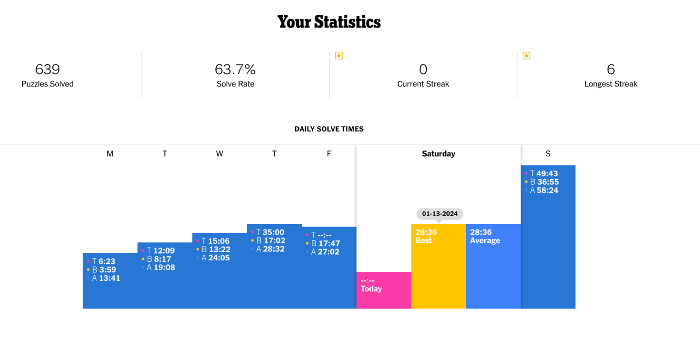
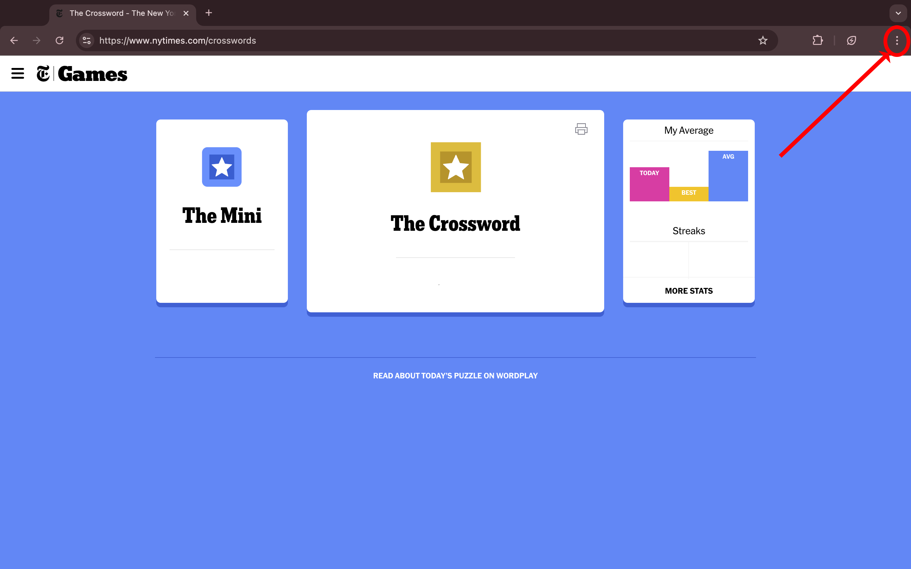
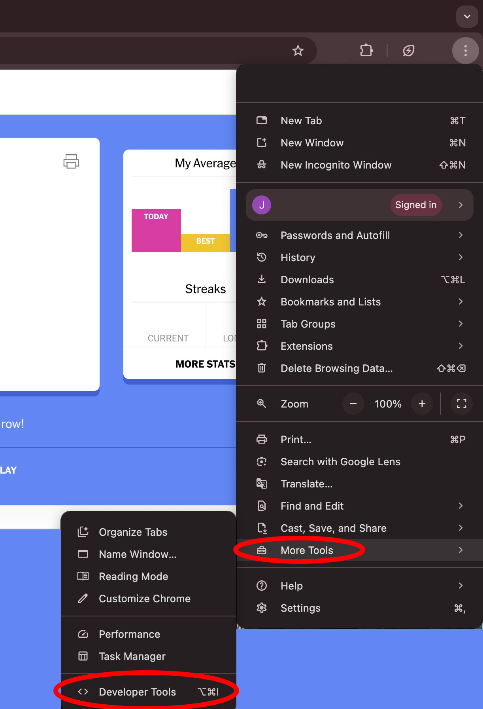
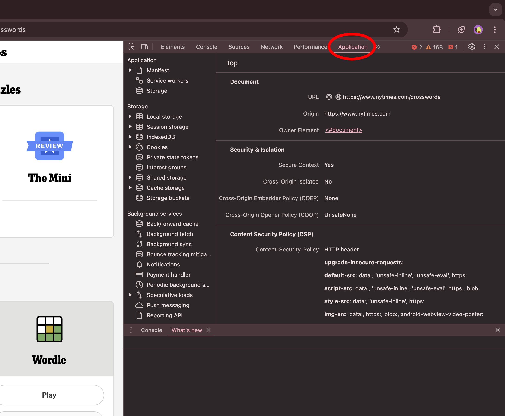
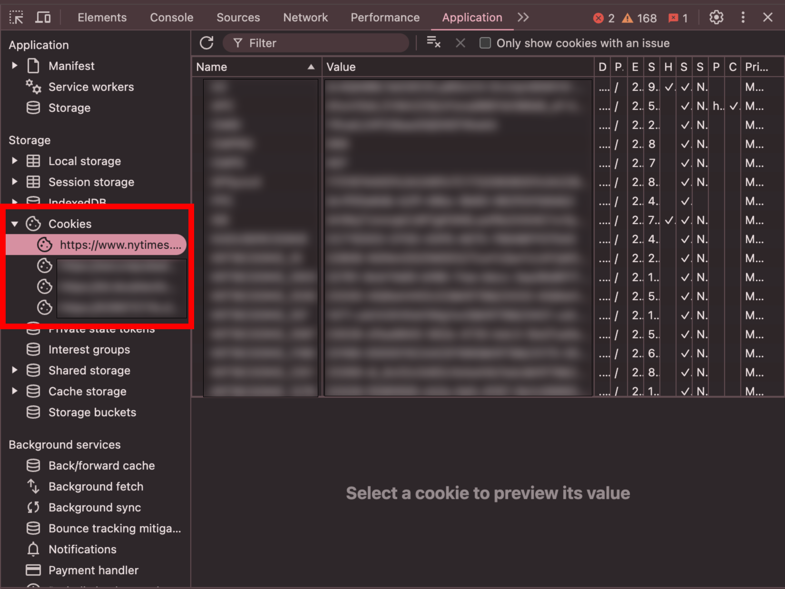
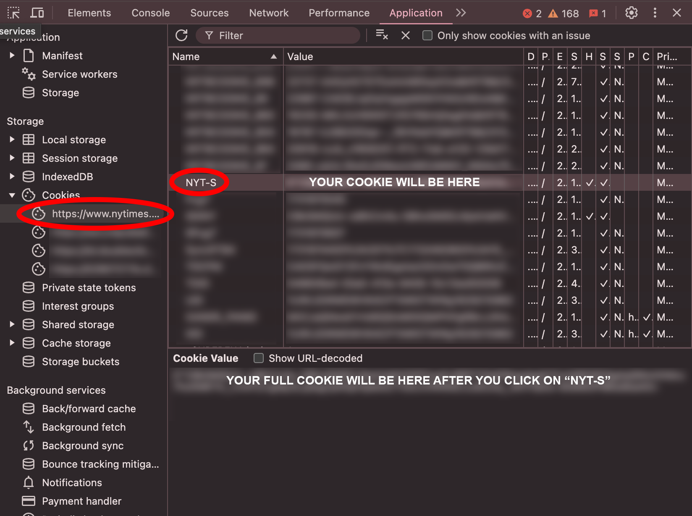

# Introduction
Easily recognized by their symmetric grids and numbered squares, crosswords have provided entertainment and fun for over a century. While crossword puzzles have existed in print media, such as newspapers, for most of their existence, the emergence of the internet and the digital world opened brand new doors of possibility for the future of crosswords.
 
The New York Times (NYT) is widely known and recognized for publishing high-quality and thought-provoking puzzles. They have three types of puzzles: Daily puzzles, which are the standard-size (15x15 grid Monday-Saturday and 21x21 grid on Sunday) puzzles that get released every day; Mini puzzles, which are a 5x5 grid and are released daily; Bonus puzzles, which are released on the first day of every month and typically are strongly tied to a theme.

With such large amounts of data from their app, the NYT has an opportunity to provide users with statistics and visualizations about their solve times. However, nearly no data or insights are provided openly to users.


A screenshot of the current NYT Daily crossword statics page on their website. There is no statistics page for the mini or bonus puzzles.

With this project, I aim to provide users with insights into their crossword data. Visualizations will show patterns, statistics, and expand upon the statistics that the NYT currently provides.

# NYT Crossword Lingo
**Gold Star** -- A puzzle recieves a **gold star** if it is completed on the print date (which, for gold star purposes, starts at 10pm EST the day before Tues-Sat and at 6pm EST Sun-Mon and ends 3am EST the following day) and is solved with no hints.

**Mini Puzzle** -- The NYT Mini was first published in August 2014 and quickly become a puzzler favorite. The mini is a 5x5 grid Sun-Fri and a 7x7 grid on Saturday. A new puzzle is released everyday.

**Bonus Puzzles** -- Published on the first of every month, Bonus puzzles 15x15 grids that are each closely tied to a different theme. Some past titles include Beyhive Buzz (Beyonce theme), National Homemade Cookie Day (cookie themed), Luck of the Irish (Ireland themed), and National Golf Month (golf themed). There is a bonus puzzle for everyone!

**Daily Puzzles** -- Daily puzzles are the classic crosswords that have been published in the NYT for over 80 years. The daily puzzles are unique in that the difficulty of the puzzles varies throughout the week. 

- Monday - easiest
- Tuesday - a touch harder than Monday, but still relatively easy
- Wednesday - more difficult than Monday and Tuesday
- Thursday - not necessarily more difficult than Wednesday in the content of the clues, but in the wordplay and gameplay is more difficult
- Friday - more difficult than Wednesday and Thursday
- Saturday - most difficult of the week (I struggle with Saturdays and rarely finish them)
- Sunday - Wednesday/Thursday difficulty but themed and larger grid


Mon-Sat are 15x15 grids and Sunday puzzles are a 21x21 grid

**Rebus** -- A rebus is when there are multiple letters put into a single box in a crossword. These most commonly occur on Thursdays and Sundays (but can occur on any day) and make for some really great themes and wordplay.

# Running the App

## 1. Prerequisites
You must be using Python 3.8.8 or higher.

## 2. Clone the Repository

If you have git, this can be done by running the following in a new terminal:

### With git:

1. ```bash
    git clone https://github.com/jorbler/crossword-stats-app.git
    ```

2. ```bash
    cd crossword-stats-app
    ```

### Via ZIP download:
If you do not have git, you can download this repository by clicking the green "<> Code" button on the top right of the GitHub repository page and click "Download ZIP" from the dropdown. Unzip this ZIP file and make sure you know where the unzipped folder is located.

Open the terminal and navigate to the location of the folder by typing 

```bash
cd FOLDER_LOCATION
```

if your folder was in your downloads folder, for example, you would type something like 
```bash
cd Downloads/crossword-stats-app
```

If you are having trouble or are getting errors, type `ls` and hit enter. All of the folders/files in the current directory will be listed and you can change the directory one folder at a time.

## 3. Install required packages

```bash
pip install -r requirements.txt
```

## 4. Run the App!
**Before running the app, please look at the data section (directly below)**

```bash 
python3 crossword_app.py
```

# Data
To run the app with your own data, you will first need to get your cookie associated with your NYT Games account, which you can do by following the instructions below.

If you do not have a NYT Games account or do not want to load your own data, you can choose to use sample data by clicking "Use Sample Data" in the welcome window.

**If you are using the sample data the refresh button in the app will be disabled!**

## Getting your cookie

1. Open https://www.nytimes.com/crosswords in Google Chrome.

2. Log in to your account if not already logged in.

3. Click on the three dots in the top right corner of the window


4. Click on "More Tools" and then "Developer Tools"


5. Click on "Application"



6. On the left panel, click "Cookies"; this will show a drop-down menu below. Click on "https://nytimes.com"


7. Under the "Name" column, scroll down to find "NYT-S". The value for your cookie will be in the "Value" column, however it will be truncated. Click on "NYT-S" in the "Name" column. Your full cookie will be in the bottom panel (showed below). Highlight the full cookie and copy it.


8. When you open the app, you will be prompted for your cookie. Paste it in the box and wait for your data to load!

# Contact
This project was created by Jordan B. Lerner at William & Mary as part of her Data Science capstone class.

If you have any questions, suggestions, or comments, please feel free to reach out via email: jordanblerner@gmail.com


